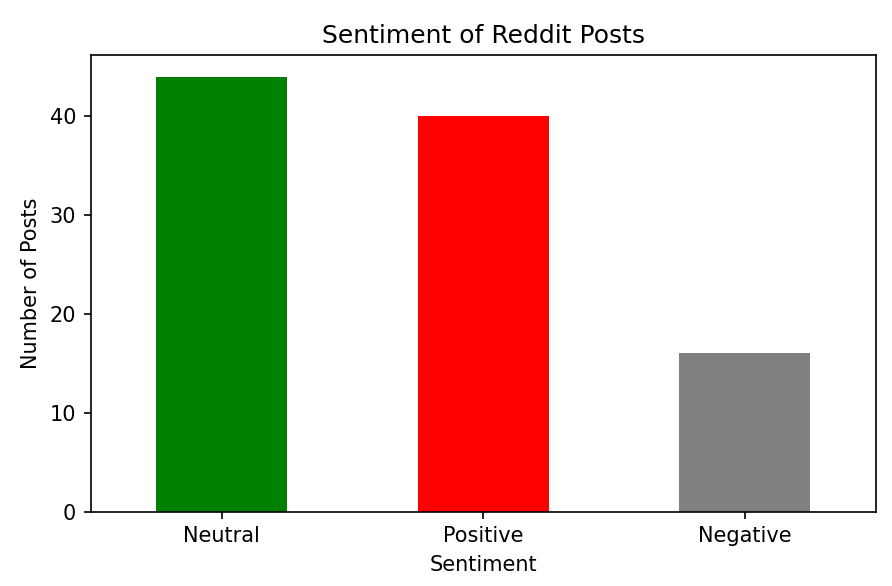

# Reddit-Sentiment-Analyzer
A simple Reddit sentiment analysis tool that fetches top posts from the 'datascience' subreddit and performs sentiment analysis using the VADER sentiment analysis library. The tool categorizes posts into Positive, Neutral, or Negative sentiment.
## Features:
- Fetches top posts from the 'datascience' subreddit.
- Cleans the post text for analysis.
- Analyzes sentiment using VADER.
- Categorizes posts as Positive, Neutral, or Negative.
- Saves the results as a CSV file.
- Visualizes sentiment distribution using bar charts.

## Installation:
1. Clone the repository:
    ```bash
    git clone https://github.com/chaitanyakank/Reddit-Sentiment-Analyzer.git
    ```
2. Navigate to the project directory:
    ```bash
    cd Reddit-Sentiment-Analyzer
    ```
3. Install the required dependencies:
    ```bash
    pip install -r requirements.txt
    ```

## Usage:
1. Set up your Reddit API credentials by filling in the `client_id`, `client_secret`, and `user_agent` in the Python script (`reddit_scraper.py`).
2. Run the script:
    ```bash
    python reddit_scraper.py
    ```
3. The script will fetch top posts from the 'datascience' subreddit, perform sentiment analysis, and save the results to a CSV file (`reddit_sentiment_results.csv`).
4. A bar chart will display the sentiment distribution of posts.

## Requirements:
- Python 3.x
- `pandas`
- `nltk`
- `praw`
- `matplotlib`



## Contributing:
Contributions are welcome! Feel free to fork the repository and submit a pull request.

## License:
This project is licensed under the MIT License - see the [LICENSE](LICENSE) file for details.
